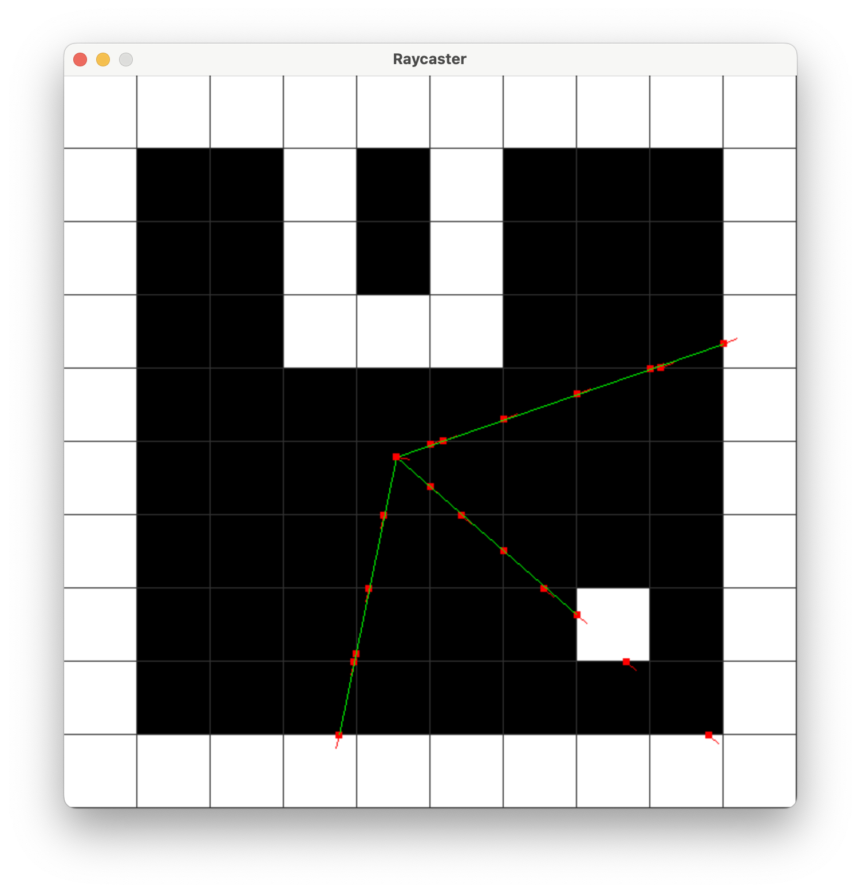
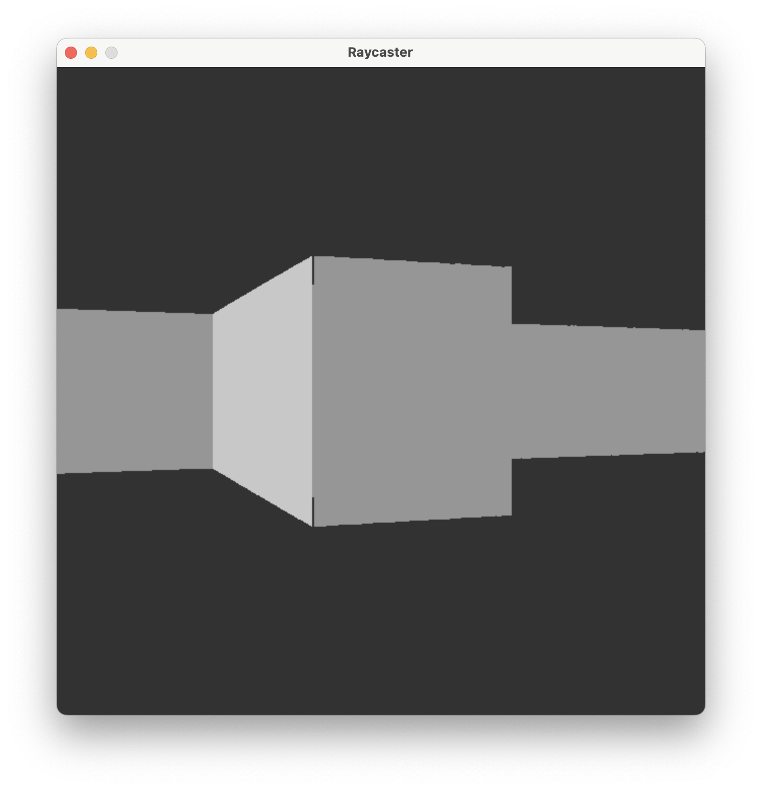

# Raycaster-engine

Les premiers "jeux 3D" comme Wolfenstein utilisaient des ray-caster pour donner l'illusion de perspectives dans un monde représenté par une grille 2D.

On envoie des rayons depuis le joueur et on effectue des calculs judicieux pour calculer très rapidement les intersections avec la grille, afin de savoir à quel distance le joueur se situe du mur.

En fonction de la proximité du mur à un angle donné, on affiche une barre verticale plus ou moins haute sur l'écran.

Utiliser Z,Q,S,D Pour se déplacer !